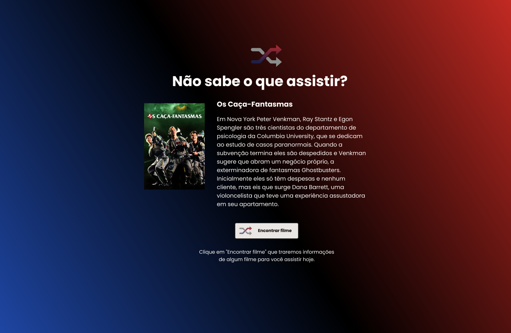

# RocketShoes

 

## Projeto 💻
Projeto de um desafio da Rocketseat, utilizar a API do themoviedb.org para exibir um filme aleatório sempre que clicar em Encontrar Filme.

## Layout 🔖
Segue abaixo o layout deste projeto:
- [Figma](https://www.figma.com/file/3HjhlACAEuHif6CEAfpHCn/DD-%2F-Rocketflix-(Copy)?type=design&node-id=302-12&t=YNKC5BuEbktRpyv5-0)

## Instalação 🛠
Siga esses passos para instalar o repositório na sua máquina:
1. Rode `git clone https://github.com/marcosfmd/rocket-flix` para fazer um clone desse repositório.
2. Abra o arquivo HTML.

## Tecnologias 🚀
As tecnologias utilizadas neste projeto são:
- HTML
- CSS
- JavaScipt
- fetch
- Git e GitHub

## Deploy 🚀

- [Projeto hospedador](https://marcosfmd.github.io/rocket-flix)

## Créditos ❤️